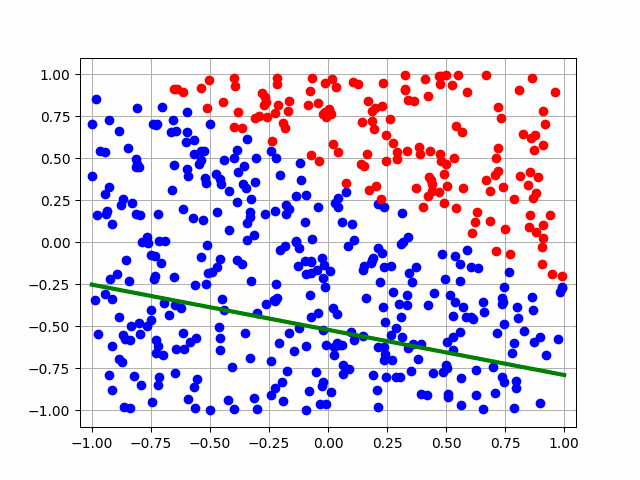

# JAX_LogReg

This project implements logistic regression from scratch using JAX, demonstrating the power and flexibility of JAX for numerical computing and machine learning tasks.

## Table of Contents
1. [Introduction to JAX](#introduction-to-jax)
2. [Project Overview](#project-overview)
3. [Installation](#installation)
4. [Usage](#usage)
5. [Implementation Details](#implementation-details)
6. [JAX-Specific Features](#jax-specific-features)
7. [Results](#results)
8. [Further Improvements](#further-improvements)

## Introduction to JAX

JAX is a powerful library for high-performance numerical computing and machine learning research. It combines NumPy's familiar API with the benefits of GPU/TPU acceleration and automatic differentiation. Key features of JAX include:

- **Just-In-Time (JIT) compilation**: Speeds up code by compiling it to optimized machine code.
- **Automatic Differentiation**: Computes derivatives of numerical functions.
- **Vectorization**: Efficiently applies functions over arrays of inputs.
- **GPU/TPU support**: Leverages hardware acceleration for computations.

## Project Overview

This project implements logistic regression, a fundamental machine learning algorithm, using JAX. The implementation includes:

1. Generating a toy dataset
2. Defining the logistic regression model
3. Implementing the loss function
4. Performing gradient descent optimization
5. Visualizing the decision boundary and training process

## Installation

To run this project, you need to install the required dependencies. You can do this using pip:

```bash
pip install -r requirements.txt
```

The `requirements.txt` file contains:

```
jax
jaxlib
matplotlib
imageio
numpy
```

## Usage

To run the logistic regression:

1. Clone this repository:
   ```bash
   git clone https://github.com/your-username/JAX-Logistic-Regression.git
   cd JAX-Logistic-Regression
   ```

2. Run the Python script:
   ```bash
   python logistic_regression_jax.py
   ```

This will execute the logistic regression, save plot images for each iteration, create a GIF of the training process, and save a plot of the loss values.

## Implementation Details

The implementation consists of several key components:

1. **Data Generation**: We create a toy dataset using JAX's random number generation.

2. **Model Definition**: The logistic regression model is defined as `h_theta(params, x)`.

3. **Loss Function**: We use binary cross-entropy loss, implemented in the `loss(params, x, y)` function.

4. **Gradient Calculation**: JAX's `grad` function is used to automatically compute gradients.

5. **Gradient Descent**: We implement a simple gradient descent algorithm to optimize the model parameters.

6. **Visualization**: The `plot_points` function visualizes the data points and decision boundary.

## JAX-Specific Features

This implementation showcases several JAX-specific features:

1. **JAX NumPy (jnp)**: We use JAX's NumPy-like API for numerical operations.

2. **Random Number Generation**: JAX requires explicit PRNG key management for random number generation.

3. **Automatic Differentiation**: The `grad` function from JAX is used to compute gradients automatically.

4. **JIT Compilation**: Although not used in this basic implementation, JIT compilation can be easily added to speed up computations.

## Results

The training process is visualized in the `grad_descent.gif` file, showing how the decision boundary evolves over iterations. The `loss_plot.png` shows the decrease in loss over training iterations.



## Further Improvements

This basic implementation can be extended in several ways:

1. Use `@jit` decorator to compile and optimize functions.
2. Implement mini-batch gradient descent using `vmap` for vectorization.
3. Add regularization to prevent overfitting.
4. Experiment with different optimization algorithms available in JAX.
5. Extend to multi-class classification problems.

Feel free to contribute to this project by implementing these improvements or suggesting new features!

